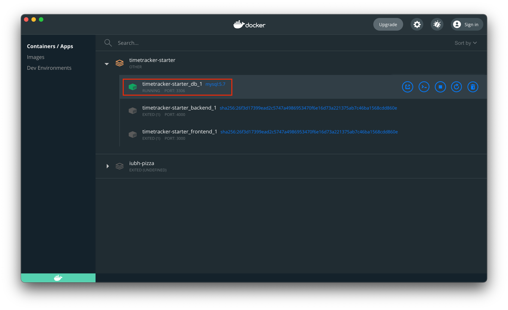
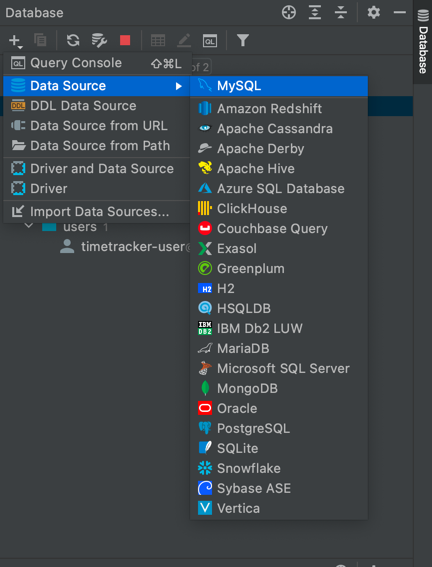
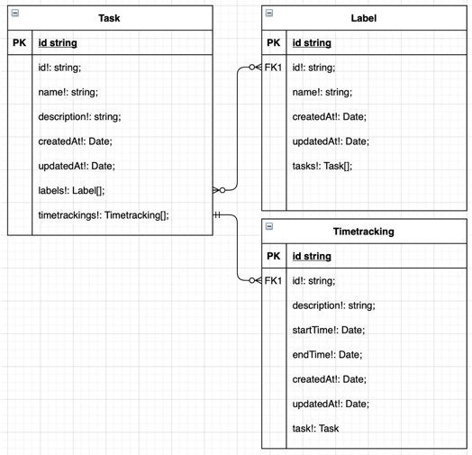

# Dieses Projekt wurde mit Create React App erstellt

Das Projekt wurde mit [Create React App](https://github.com/facebook/create-react-app) bootsgetrapped.

## Projekt aufsetzen

####Achtung: dieses Projekt wurde mit IntelliJ als IDE erstellt, daher wird diese IDE zum clonen empfohlen

1. Clone das Projekt zunächst über HTTPS --> https://github.com/Teoki/timetracker-teo.git
2. Begib dich ins Hauptverzeichnis des Projekts und starte die DB im "docker-compose.yaml" File, falls du dir unsicher bist, ob die DB läuft, kannst du dir "Docker Desktop" 
   (unter https://www.docker.com/products/docker-desktop) installieren 
   und dort die DB händisch starten. Das Ergebnis sollte so aussehen:
   
3. Navigiere im Terminal in das "backend"-Verzeichnis und installiere die dependencies mit dem Befehl: `npm install`
4. Navigiere im Terminal in das "frontend"-Verzeichnis und installiere die dependencies mit dem Befehl: `npm install`
5. Datenbank zu IntelliJ-IDE hinzufügen: 
    1. Klicke auf der rechten Seite auf "Database", dann auf "+" und wähle MySQL aus:
  
    2.  Gebe folgende Werte ein:
        1. Host: localhost
        2. Port: 3306
        3. Username: timetracker-user
        4. Password: 123456789
6. Du wirst unten gefragt, ob du die Treiber installieren willst. Installiere Sie indem du auf den Link klickst
7. Klicke auf "Test Connection", falls es funktioniert hat, klicke "Apply" und bestätige/schließe das Fenster mit Klick auf den rechten Button daneben
8. Navigiere zu "backend/package.json" und führe "schema:sync": "typeorm schema:sync" aus (klick auf grünen play button auf der linken seite)
9. Nun kannst du das backend/frontend starten:
    1. Starte immer zuerst das backend indem du zum "backend/package.json" navigierst und führe `"start": "tsc-watch --outDir ./dist --onSuccess 'node dist/index.js'"` unter "scripts" aus 
       (klick auf grünen play button auf der linken seite)
    2. Starte das frontend indem du zum "frontend/package.json" navigierst und führe `"start": "react-scripts start"` unter "scripts" aus (klick auf grünen play button auf der linken seite)
10. Wenn die DB, backend und frontend laufen, öffne einen Browser (bevorzugt Google-Chrome) und öffne den Link http://localhost:3000/api/task.

Extras: folgende Frameworks und API's wurden verwendet. Du kannst diese folgendermaßen bei anderen Projekten verwenden:
- Material-UI installieren: in frontend directory gehen und dann:
npm install @material-ui/core
- Für die Haupttabelle mit den ganzen Tasks:
npm install material-table --save
- Für die Material-ui icons:
npm install @material-ui/icons --save
- Für Routing:
npm install --save react-router-dom
- Für requests:
npm install axios
  
###Falls du probleme mit den einzelnen API's bzw. Frameworks hast, installiere sie auch als "dev", dazu wird dir meistens ein Vorschlag von der IDE gegeben 
(oder option+enter auf den jeweiligen Fehler ausführen und die jeweilige Option auswählen)

## Funktionalitäten

Die Benutzung der Kern-Funktionalitäten werden im Absatz "Testen" genauer beschrieben. In diesem Absatz werden sie ausschließlich aufgelistet und beziehungen verdeutlicht.

## Funktionalitäten im frontend:

Task-Dashboard-Seite:
- Aufteilung der Task-Dashboard-Seite in einen Header, Seitenleiste und Hauptbereich mit der TaskTable  
- Alle Tasks in der Datenbank werden in der TaskTable aufgelistet
- Mit der TaskTable kann 
   1. die Seitengröße angepasst werden (5, 10 oder 20 Tasks pro Tabellenseite)
   2. durch die einzelnen Seiten bzw. auf die erste und letzte Seite navigiert werden
   3. nach jedem String in der Tabelle gesucht werden (z. B. ID, Name, Description und Timestamps)
   4. jedes Element alphabetisch Sortiert werden
- In der Seitenleiste können Tasks und Labels erstellt/bearbeitet und gelöscht werden. Dabei sind die Pflichtfelder mit einem Stern * markiert
- Material-UI-Elemente für eine moderne UX und UI

Zum Auflisten/Erstellen/Löschen und Bearbeiten von Timetrackings wird im nächsten Absatz "Testen" eingegangen.

## Funktionalitäten im backend:

- CRUD-System: es ist möglich mittels einer HTTP-API sowohl Tasks, Trackings als auch Labels zu erstellen anzuzeigen, aufzulisten, upzudaten und zu löschen. Wie das im backend funktioniert wird im 
  Absatz "Testen" näher beschrieben.
- Validation des CRUD-System in den "controller"-files (z. B. 400 "Bad Request" als response, falls ein Task/Label/Timetracking mit einem bestimmten Namen bereits existiert oder falls eine ID bei 
  einer Suche nicht existiert und 500 "Internal Server Error", falls auf einen bestimmten Request nicht anders geantwortet werden kann)
- Logging für alle CRUD-Systems, um zu sehen ob ein request erfolgreich war; Falls ein requests gescheitert ist, werden entsprechende Fehler genau abgefangen und geloggt  
- Alle entities haben die geforderten Attribute:
   1. Task: id, name, description, timestamps (created & updated at) (siehe backend/src/entity/task.model.ts)
   2. Label: id, name, timestamps (created & updated at) (siehe backend/src/entity/label.model.ts)
   3. Timetracking:  id, description, startTime, endTime, timestamps (created & updated at) (siehe backend/src/entity/timetracking.model.ts)
- Geforderte Relationen wurden wie folgt umgesetzt:
  
  (Quelle: eigene Darstellung)
   1. Ein Task kann 0 oder N Trackings haben (siehe backend/src/entity/task.model.ts --> Attribut: "timetrackings")
   2. Ein Label kann 0 oder N Tasks haben und ein Task kann 0 oder N Labels haben (siehe backend/src/entity/task.model.ts & backend/src/entity/label.model.ts 
      --> Attribute: in Task "labels" & in Label "tasks")
- Routen:
   1. globalRouter unter "/", liefert nur eine Willkommensnachricht
   2. taskRouter unter "/task" und dann jeweils get("/"), get("/:id"), post("/"), put("/:id") und delete("/:id") hinten dran hängen
   2. labelRouter unter "/label" und dann jeweils get("/"), get("/:id"), post("/"), put("/:id") und delete("/:id") hinten dran hängen
   2. timetrackingRouter unter "/timetracking" und dann jeweils get("/"), post("/"), put("/:id") und delete("/:id") hinten dran hängen
- offene Funktionalitäten wurden im Programmcode mit einem "TODO" kommentiert    

## Funktionalitäten in der Datenbank:

Die MySQL-Datenbank beinhaltet folgende Tabellen und arbeitet mit den Funktionalitäten aus dem backend:
- task --> mit id (als Primärschlüssel), name, description, createdAt und updatedAt
- label --> mit id (als Primärschlüssel), name, createdAt und updatedAt
- task_labels_label --> mit taskId und labelId
- timetracking --> mit id (als Primärschlüssel), description, createdAt, updatedAt, startTime und endTime

globalRouter.use("/timetracking", timetrackingRouter);
globalRouter.use("/task", taskRouter);
globalRouter.use("/label", labelRouter);

## Testen

## Testen im frontend:

Öffne [http://localhost:3000/api/task](http://localhost:3000/api/task) im Browser, um die laufende Applikation zu testen und anzuschauen (backend, Datenbank und frontend müssen laufen).

1. Create/Update/Delete Task: sobald die Pflichtfelder für dein jeweiliges Vorhaben befüllt 
   und mit dem Buttonklick bestätigt werden, kannst du deinen neu erstellten/bearbeiteten Task 
   in der TaskTable sehen. Gelöschte Tasks verschwinden aus der TaskTable.
2. Create/Update/Delete Label: es gilt das selbe wie bei den Tasks. Befülle die input Felder und sende deinen Request ab. Die Ergebnisse sind jedoch nur in der Datenbank selbst ersichtlich.
3. Create/Update/Delete Timetracking: Timetrackings können ausschließlich per manuelle requests über z. B. Postman (im backend) getestet werden. 

## Testen im backend:

Alle Postman requests auf einem Blick:
Öffne hierzu Postman und schicke folgende Requests ab:
[ACHTUNG: sobald eine falsche id übergeben wird oder ein Task/Label/Timetracking mit einem bestimmten Namen bereits existiert,
wird eine 400 "Bad Request" als response ankommen. 
Nähere details zum fehlgeschlagenen request lassen sich aus der console in IntelliJ entnehmen.]

## Postman requests für Tasks
- GET localhost:4000/api/task/{jeweilige id} --> um eine Task mit einer bestimmten ID zu holen
- GET localhost:4000/api/task/ --> um alle Tasks, welche sich in der Datenbank befinden zu holen
- POST http://localhost:4000/api/task & JSON-Body: {"task": {"name":"neue Task","description":"neue Task description"} } --> um eine neue Task anzulegen
- PUT localhost:4000/api/task/{jeweilige id} & JSON-Body: {"updateTask": {"name": "Updated","description": "Das update klappt"} } --> um eine existierende Task zu bearbeiten
- DELETE localhost:4000/api/task/{jeweilige id} --> um eine existierende Task zu löschen

## Postman requests für Labels
- GET localhost:4000/api/label/{jeweilige id} --> um ein Label mit einer bestimmten ID zu holen
- GET localhost:4000/api/label/ --> um alle Labels, welche sich in der Datenbank befinden zu holen
- POST http://localhost:4000/api/label & JSON-Body: {"label": {"name":"neuer Label"} } --> um ein neues Label anzulegen
- PUT localhost:4000/api/label/{jeweilige id} & JSON-Body: {"updateLabel": {"name": "updatedLabel"} } --> um ein existierendes Label zu bearbeiten
- DELETE localhost:4000/api/label/{jeweilige id} --> um ein Label zu löschen

## Postman requests für Timetrackings
- GET localhost:4000/api/timetracking/{jeweilige id} --> um ein Timetracking mit einer bestimmten ID zu holen
- GET localhost:4000/api/timetracking/ --> um alle Timetrackings, welche sich in der Datenbank befinden zu holen
- POST http://localhost:4000/api/timetracking & JSON-Body: {"timetracking": {"description":"new Timetracking"} } --> um ein neues Timetracking anzulegen
- PUT localhost:4000/api/timetracking/{jeweilige id} & JSON-Body: {"updateTimetracking": {"name": "updated Tracking"} } --> um ein existierendes Timetracking zu bearbeiten
- DELETE localhost:4000/api/timetracking/{jeweilige id} --> um ein Timetracking zu löschen

## Freestyle task
####extra features im frontend mit externen API's und Frameworks, welche nicht in der Aufgabenstellung gefordert wurden:
1. Suche nach allen Elementen der TaskTable (material-table Framework): es kann nach allen Elementen in der TaskTable auf dem Task-Dashboard gesucht werden (z. B. ID, Name, Description und Timestamps; alle anderen rows werden ausgeblendet, außer das gesuchte)
2. Alphabetische Sortierung: alle Elemente in der TaskTable können Alphabetisch ab- und aufsteigend Sortiert werden
3. Einstellbare Seitengröße der TaskTable: es kann entweder 5, 10 oder 20 rows in der Table gleichzeitig angezeigt werden
4. Seitennavigation in der TaskTable: in der TaskTable kann man durch die einzelnen Table-Seiten navigieren (falls z.B. mehr als 5 Tasks existieren, aber nur 5 auf einer Page angezeigt werden)
5. Zusätzlich kann auf die erste bzw. letzte Table-Seite gesprungen werden
6. Axios als HTTP-API, um requests im Programmcode leichter les- und nutzbar zu gestalten
7. Material-UI-Elemente (material-ui Framework) wurden über das gesamte frontend hinweg genutzt --> modernes UI- und UX-Design