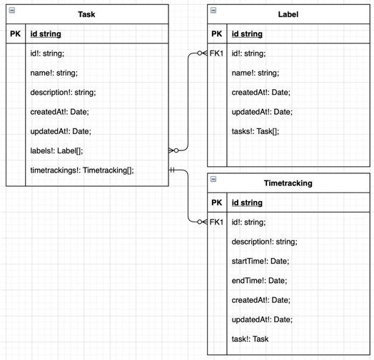

# Dieses Projekt wurde mit Create React App erstellt

Das Projekt wurde mit [Create React App](https://github.com/facebook/create-react-app) bootsgetrapped.

## Projekt aufsetzen

Navigiere jeweils in das backend und frontend Verzeichnis und führe den folgenden Befehl aus:

### `npm install`

Für die Datenbank:
1. Navigiere in die "docker-compose.yaml" und starte die DB durch den befehl

### `npm start`

Runs the app in the development mode.\

## Funktionalitäten

Die Benutzung der Kern-Funktionalitäten werden im nächsten Absatz "Testen" genauer beschrieben. In diesem Absatz werden sie kurz aufgelistet:

## Funktionalitäten im frontend:

Task-Dashboard-Seite:
- Aufteilung der Task-Dashboard-Seite in einen Header, Seitenleiste und Hauptbereich mit der TaskTable  
- Alle Tasks in der Datenbank werden in der TaskTable aufgelistet
- Mit der TaskTable kann 
   1. die Seitengröße angepasst werden (5, 10 oder 20 Tasks pro Tabellenseite)
   2. durch die einzelnen Seiten bzw. auf die erste und letzte Seite navigiert werden
   3. nach jedem String in der Tabelle gesucht werden (z. B. ID, Name, Description und Timestamps)
   4. jedes Element alphabetisch Sortiert werden
- In der Seitenleiste können Tasks und Labels erstellt/bearbeitet und gelöscht werden. Dabei sind die Pflichtfelder mit einem Stern * markiert
- Material-UI-Elemente für eine moderne UX und UI

Zum Auflisten/Erstellen/Löschen und Bearbeiten von Timetrackings wird im nächsten Absatz "Testen" eingegangen.

## Funktionalitäten im backend:

- CRUD System: es ist möglich mittels einer HTTP-API sowohl Tasks, Trackings als auch Labels zu erstellen anzuzeigen, aufzulisten, upzudaten und zu löschen. Wie das im backend funktioniert wird im Absatz "Testen" näher beschrieben.
- Alle entities haben die geforderten Attribute:
   1. Task: id, name, description, timestamps (created & updated at) (siehe backend/src/entity/task.model.ts)
   2. Label: id, name, timestamps (created & updated at) (siehe backend/src/entity/label.model.ts)
   3. Timetracking:  id, description, startTime, endTime, timestamps (created & updated at) (siehe backend/src/entity/timetracking.model.ts)
- Geforderte Relationen wurden wie folgt umgesetzt:
  
  (Quelle: eigene Darstellung)
   1. Ein Task kann 0 oder N Trackings haben (siehe backend/src/entity/task.model.ts --> Attribut: "timetrackings")
   2. Ein Label kann 0 oder N Tasks haben und ein Task kann 0 oder N Labels haben (siehe backend/src/entity/task.model.ts & backend/src/entity/label.model.ts --> Attribute: in Task "labels" & in Label "tasks")
- Routen:
   1. globalRouter unter "/", liefert nur eine Willkommensnachricht
   2. taskRouter unter "/task" und dann jeweils get("/"), get("/:id"), post("/"), put("/:id") und delete("/:id") hinten dran hängen
   2. labelRouter unter "/label" und dann jeweils get("/"), get("/:id"), post("/"), put("/:id") und delete("/:id") hinten dran hängen
   2. timetrackingRouter unter "/timetracking" und dann jeweils get("/"), post("/"), put("/:id") und delete("/:id") hinten dran hängen
- 
- offene Funktionalitäten wurden im Programmcode mit einem "TODO" kommentiert    

globalRouter.use("/timetracking", timetrackingRouter);
globalRouter.use("/task", taskRouter);
globalRouter.use("/label", labelRouter);

## Testen

## Testen im frontend:

Öffne [http://localhost:3000/api/task](http://localhost:3000/api/task) im Browser, um die laufende Applikation zu testen und anzuschauen (backend, Datenbank und frontend müssen laufen).

1. Create/Update/Delete Task: sobald die Pflichtfelder für dein jeweiliges Vorhaben befüllt 
   und mit dem Buttonklick bestätigt werden, kannst du deinen neu erstellten/bearbeiteten Task 
   in der TaskTable sehen. Gelöschte Tasks verschwinden aus der TaskTable.
2. Create/Update/Delete Label: es gilt das selbe wie bei den Tasks. Befülle die input Felder und sende deinen Request ab. Die Ergebnisse sind jedoch nur in der Datenbank selbst ersichtlich.
3. Create/Update/Delete Timetracking: Timetrackings können ausschließlich per manuelle requests über z. B. Postman (im backend) getestet werden. 

## Testen im backend:

Alle Postman requests auf einem Blick:
Öffne hierzu Postman und schicke folgende Requests ab:
[ACHTUNG: sobald eine falsche id übergeben wird oder ein Task/Label/Timetracking mit einem bestimmten Namen bereits existiert,
wird eine 400 "Bad Request" als response ankommen. 
Nähere details zum fehlgeschlagenen request lassen sich aus der console in IntelliJ entnehmen.]

## Postman requests für Tasks
- GET localhost:4000/api/task/{jeweilige id} --> um eine Task mit einer bestimmten ID zu holen
- GET localhost:4000/api/task/ --> um alle Tasks, welche sich in der Datenbank befinden zu holen
- POST http://localhost:4000/api/task & JSON-Body: {"task": {"name":"neue Task","description":"neue Task description"} } --> um eine neue Task anzulegen
- PUT localhost:4000/api/task/{jeweilige id} & JSON-Body: {"updateTask": {"name": "Updated","description": "Das update klappt"} } --> um eine existierende Task zu bearbeiten
- DELETE localhost:4000/api/task/{jeweilige id} --> um eine existierende Task zu löschen

## Postman requests für Labels
- GET localhost:4000/api/label/{jeweilige id} --> um ein Label mit einer bestimmten ID zu holen
- GET localhost:4000/api/label/ --> um alle Labels, welche sich in der Datenbank befinden zu holen
- POST http://localhost:4000/api/label & JSON-Body: {"label": {"name":"neuer Label"} } --> um ein neues Label anzulegen
- PUT localhost:4000/api/label/{jeweilige id} & JSON-Body: {"updateLabel": {"name": "updatedLabel"} } --> um ein existierendes Label zu bearbeiten
- DELETE localhost:4000/api/label/{jeweilige id} --> um ein Label zu löschen

## Postman requests für Timetrackings
- GET localhost:4000/api/timetracking/{jeweilige id} --> um ein Timetracking mit einer bestimmten ID zu holen
- GET localhost:4000/api/timetracking/ --> um alle Timetrackings, welche sich in der Datenbank befinden zu holen
- POST http://localhost:4000/api/timetracking & JSON-Body: {"timetracking": {"description":"new Timetracking"} } --> um ein neues Timetracking anzulegen
- PUT localhost:4000/api/timetracking/{jeweilige id} & JSON-Body: {"updateTimetracking": {"name": "updated Tracking"} } --> um ein existierendes Timetracking zu bearbeiten
- DELETE localhost:4000/api/timetracking/{jeweilige id} --> um ein Timetracking zu löschen

### `yarn test`

Launches the test runner in the interactive watch mode.\
See the section about [running tests](https://facebook.github.io/create-react-app/docs/running-tests) for more information.

### `yarn build`

Builds the app for production to the `build` folder.\
It correctly bundles React in production mode and optimizes the build for the best performance.

The build is minified and the filenames include the hashes.\
Your app is ready to be deployed!

See the section about [deployment](https://facebook.github.io/create-react-app/docs/deployment) for more information.

### `yarn eject`

**Note: this is a one-way operation. Once you `eject`, you can’t go back!**

If you aren’t satisfied with the build tool and configuration choices, you can `eject` at any time. This command will remove the single build dependency from your project.

Instead, it will copy all the configuration files and the transitive dependencies (webpack, Babel, ESLint, etc) right into your project so you have full control over them. All of the commands except `eject` will still work, but they will point to the copied scripts so you can tweak them. At this point you’re on your own.

You don’t have to ever use `eject`. The curated feature set is suitable for small and middle deployments, and you shouldn’t feel obligated to use this feature. However we understand that this tool wouldn’t be useful if you couldn’t customize it when you are ready for it.

## Freestyle task
####extra features im frontend, welche nicht in der Aufgabenstellung gefordert wurden:
1. Suche nach allen Elementen der TaskTable: es kann nach allen Elementen in der TaskTable auf dem Task-Dashboard gesucht werden (z. B. ID, Name, Description und Timestamps; alle anderen rows werden ausgeblendet, außer das gesuchte)
2. Alphabetische Sortierung: alle Elemente in der TaskTable können Alphabetisch ab- und aufsteigend Sortiert werden
3. Einstellbare Seitengröße der TaskTable: es kann entweder 5, 10 oder 20 rows in der Table gleichzeitig angezeigt werden
4. Seitennavigation in der TaskTable: in der TaskTable kann man durch die einzelnen Table-Seiten navigieren (falls z.B. mehr als 5 Tasks existieren, aber nur 5 auf einer Page angezeigt werden)
5. Zusätzlich kann auf die erste bzw. letzte Table-Seite gesprungen werden
6. Material-UI-Elemente wurden über das gesamte frontend hinweg genutzt. --> modernes UI- und UX-Design